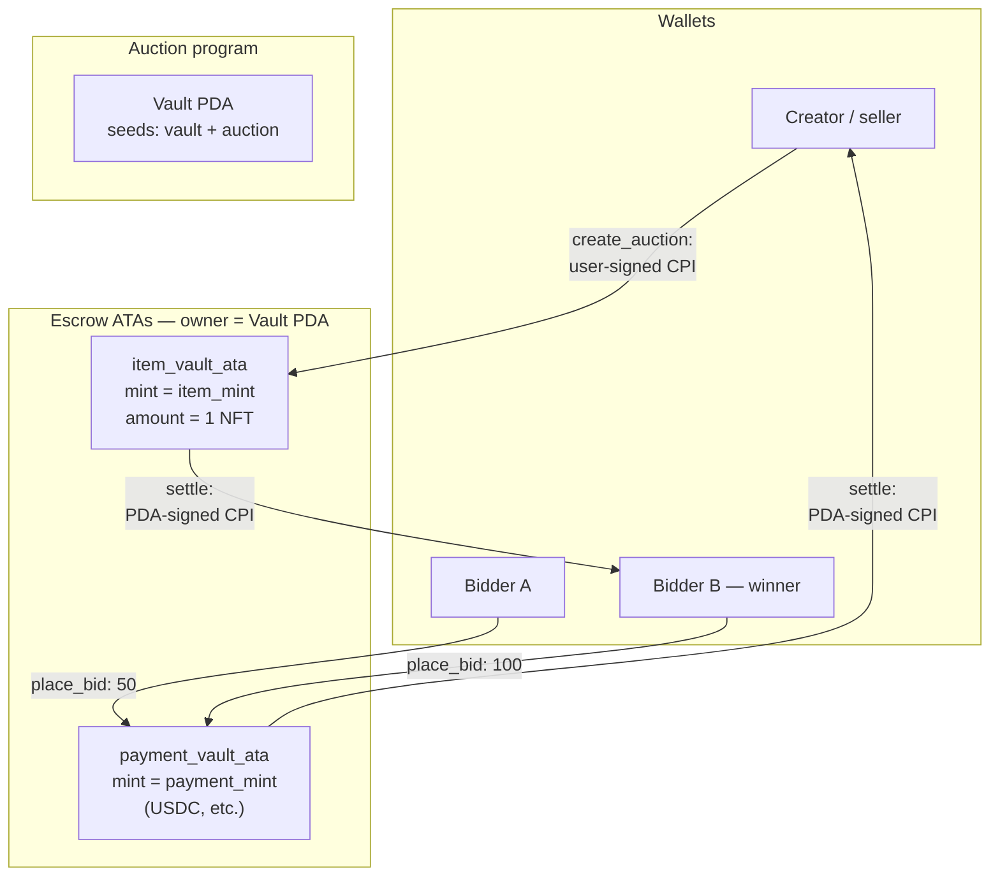
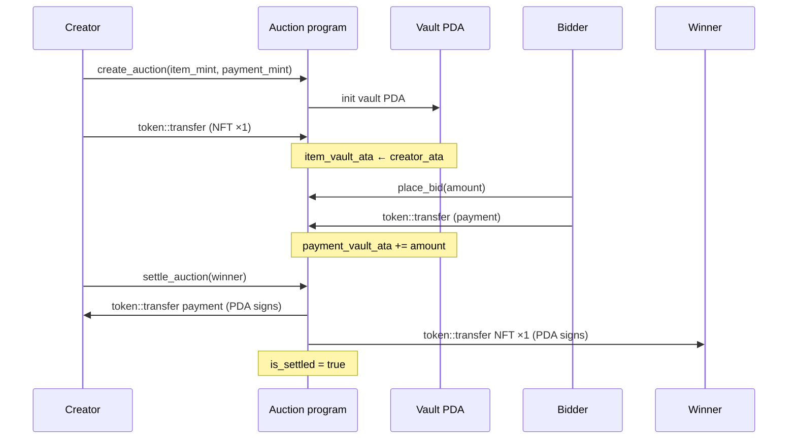
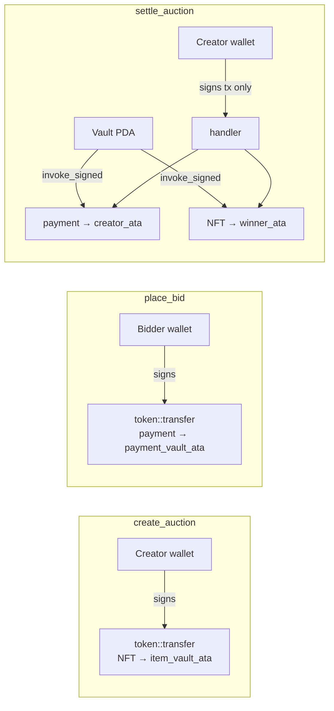
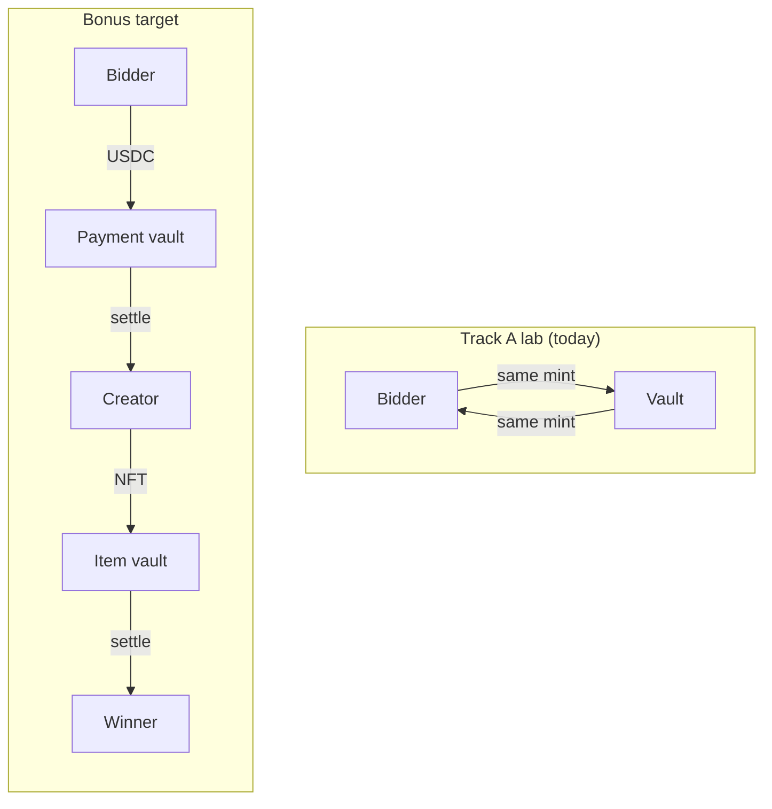

# Bonus research — Auction + NFT (not part of the lab)

The Track A lab uses **one SPL mint** to teach CPI and PDA signing. Economically, the winner should receive the **auctioned item** (e.g. an NFT), not their own bid back. This document is **optional homework**: investigate how to merge the auction vault with the NFT flow from Part 05.

**Not required for Part 06.** No solution is provided in this repo.

---

## What the lab does vs what a real auction does

| | Track A lab (today) | Realistic auction |
|---|---------------------|-------------------|
| Bidders pay | SPL tokens → vault | Payment token (USDC, etc.) → vault |
| Winner receives | Same tokens from vault | **NFT** (or other item) from escrow |
| Seller receives | *(not modeled)* | Payment from vault |
| Outbid bidders | *(not modeled)* | Refund of previous bid |

Reference code:

- Auction + vault: [`final_solution/`](final_solution/)
- NFT flow (Part 05): [`../../05-final-projects-solutions/nft-flow/`](../../05-final-projects-solutions/nft-flow/)
- NFT + fee CPI (Part 06 B): [`../nft-fee-close/final_solution/`](../nft-fee-close/final_solution/)

---

## Target architecture (investigate)

```
create_auction
  creator signs → deposit NFT (supply 1) into item_vault_ata
                  owner = auction vault PDA

place_bid
  bidder signs → payment token::transfer → payment_vault_ata

settle_auction
  vault PDA signs → payment_vault_ata → creator_ata     (seller paid)
  vault PDA signs → item_vault_ata    → winner_nft_ata  (winner gets NFT)
```

You will need **two mints** (or one mint + one NFT mint):

- `payment_mint` — fungible (bids)
- `item_mint` — NFT (`decimals = 0`, `supply = 1`)

---

## Reference diagrams

### Actors and vaults (target design)



### Instruction lifecycle



### CPI signers by instruction



### PDA and account map

```
Auction PDA          ["auction", creator, auction_id]
Vault PDA            ["vault", auction_pubkey]          ← signs both settle CPIs

payment_vault_ata    owner = Vault PDA, mint = payment_mint
item_vault_ata       owner = Vault PDA, mint = item_mint  (holds 1 NFT)
bidder_payment_ata   owner = bidder,      mint = payment_mint
creator_payment_ata  owner = creator,     mint = payment_mint
winner_item_ata      owner = winner,      mint = item_mint
```

### Lab today vs target (side by side)



---

## Research questions

Work through these in order. Write short notes or a diagram for each.

### 1. State model

- What new fields does `Auction` need? (`payment_mint`, `item_mint`, `item_vault_ata`?)
- Do you need one vault PDA or two (payment vs item)?
- How do you prove the NFT in escrow matches `auction.item_mint`?

### 2. Escrow the NFT at creation

- How does the **creator** transfer the NFT into a vault ATA on `create_auction`?
- Which account is the **authority** of `item_vault_ata`? (Hint: same pattern as bid vault — **PDA owner**.)
- What `#[account(...)]` constraints validate `decimals == 0` and `amount == 1`?

### 3. CPI to assign NFT to the winner

- On `settle_auction`, which instruction moves the NFT? (`token::transfer` with `amount = 1`.)
- Write the **signer seeds** for the vault PDA (same idea as payment settle in the lab).
- What accounts must be passed to the CPI? (`from`, `to`, `authority`, `token_program`.)
- Why must `winner` match `auction.highest_bidder` before the NFT CPI?

### 4. Pay the seller

- Should payment go to `auction.creator` on settle? Where in the handler?
- Can one `settle_auction` instruction perform **two CPIs** (payment + NFT)? What happens if the second fails?

### 5. Part 05 NFT flow vs on-chain NFT

Part 05 `nft-flow` stores a `MintState` PDA and a mint **pubkey** — it does not mint a real Metaplex NFT.

Research:

- What is the difference between that simplified model and a real Solana NFT?
- What does **Metaplex Token Metadata** add (`metadata` account, `master edition`, etc.)?
- For a minimal NFT without Metaplex: can you use `spl-token` with `mint_to` supply 1 and `decimals 0`?

### 6. Refunds (hard mode)

If Alice bids 50 and Bob bids 100, Alice’s 50 should return to her.

- When should refund happen — on each new bid or only on settle?
- Who pays rent for bidder ATAs?
- How do you avoid reentrancy / double-spend of vault balance?

### 7. Testing

- How do you create an NFT mint + fund a creator ATA in `anchor.test.ts`?
- Packages to look up: `@solana/spl-token`, optionally `@metaplex-foundation/mpl-token-metadata`.
- What assertions prove the winner’s ATA holds `amount === 1` after settle?

---

## Suggested reading

- [SPL Token program](https://spl.solana.com/token) — `transfer`, mint decimals, ATAs
- [Anchor SPL docs](https://www.anchor-lang.com/docs/tokens) — `associated_token`, `token::transfer`, `CpiContext::new_with_signer`
- [Metaplex Token Metadata](https://developers.metaplex.com/token-metadata) — if you want real NFT metadata (name, URI, collection)
- Your own [`final_solution/architecture-notes.md`](final_solution/architecture-notes.md) — reuse the CPI diagram pattern

---

## Minimal deliverable (if you try it)

Pick one scope:

**A — Smallest:** Change settle so **payment** goes to `creator` instead of `winner`. No NFT. Documents seller economics only.

**B — Medium:** Add `item_mint` + escrow NFT on create + transfer NFT to winner on settle (spl-token only, no Metaplex).

**C — Full:** B + refunds for outbid bidders + `AuctionSettled` / `NftDelivered` events + tests with real mints.

Document your PDA seeds, CPI account lists, and authority rules in an `architecture-notes.md` of your own.

---

## Out of scope even for bonus

- English or Dutch auctions with time extensions
- Royalties on secondary sales
- Composable auctions across programs (CPI into Metaplex `transfer` instruction)
- Token-2022 / compressed NFTs
